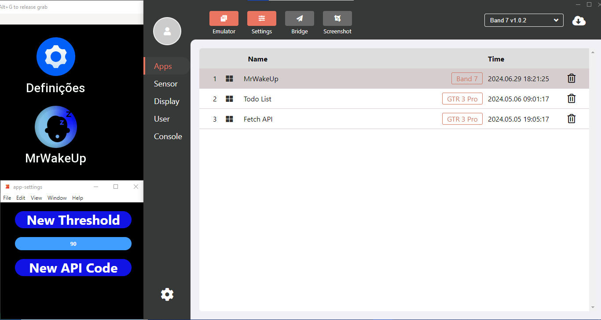
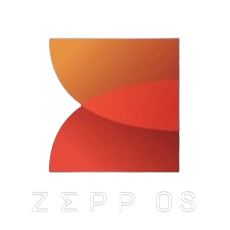

# Mr. WakeUP

Mr. WakeUP is an app designed for ZeppOS watches that helps you stay awake after you fall asleep. It is particularly useful for people with Narcolepsy, students studying through the night, or night workers staying alert during their shifts.

 <!-- Replace with your image path -->

## Badges
<!-- Add your badges here -->

## Table of Contents

- [Description](#description)
- [Installation](#installation)
- [Usage](#usage)
- [Contributing](#contributing)
- [License](#license)
- [Credits](#credits)

## Description

Mr. WakeUP helps people maintain a normal life by preventing unintended sleep episodes. It monitors your sleep patterns and wakes you up to ensure you stay alert and active.

## Installation

To see the project in action, you need to install the simulator and use the ZEUS DEV command line interface.

1. **Install the Simulator:**
   Follow the detailed instructions on the [ZeppOS Simulator Documentation](https://docs.zepp.com/docs/1.0/guides/tools/simulator/).

2. **Run ZEUS DEV:**
   Open the Command Prompt and navigate to the directory where your project is located. Run the following command:
   ```sh
   zeus dev
   ```
3. **Download Watch Version:**
   In the simulator, download the watch version you want to use. The available version is:
   - Amazfit Band 7

   ## Usage

Once the project is set up, use the simulator to test and interact with Mr. WakeUP. Adjust settings as needed to ensure it meets your needs for staying awake.

 <!-- Replace with your image path -->

## Contributing

Contributions are welcome! Please follow these steps:

1. Fork the repository.
2. Create a new branch (`git checkout -b feature-branch`).
3. Make your changes.
4. Commit your changes (`git commit -m 'Add some feature'`).
5. Push to the branch (`git push origin feature-branch`).
6. Open a pull request.

## Credits

- [Ricardo Mouro](https://github.com/Mourinhom6)
<!-- - [Contributors](path_to_contributors_page) -->

## Additional Information

For more detailed information and documentation, visit the [ZeppOS CLI Documentation](https://docs.zepp.com/docs/1.0/guides/tools/cli/).

 <!-- Replace with your image path -->


## Licença

[MIT](https://choosealicense.com/licenses/mit/)


